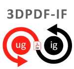

# The GitHub community for 3D PDF 
|                                          |                                          |
| ---------------------------------------- | ---------------------------------------- |
| [**3D PDF Interoperability Forum (3DPDF-IF)**](https://github.com/3D-PDF-Consortium/3DPDF-IF-Epic-1) The 3DPDF-IF is developing a set of recommended practices for creating 3D PDF 2.0 (ISO 32000:2) files with STEP AP242 data. The group is developing some very useful information on the PDF RichMedia Annotation. You can find all of the work that they are doing [here](https://github.com/3D-PDF-Consortium/3DPDF-IF-Epic-1). |  |
|  | [**PDF with glTF**](https://github.com/3D-PDF-Consortium/PDF                                          -with-glTF) The ISO working group for PDF/Engineering (ISO TC171 SC2 WG7) has formed a discussion group to look into including glTF as a 3D format that can be used in PDF 2.0 files. You can find all of the work that they are doing [here](https://github.com/3D-PDF-Consortium/PDF-with-glTF). |

---

Thanks for dropping by! If you have any questions, email us at info@3dpdfconsortium.org!
